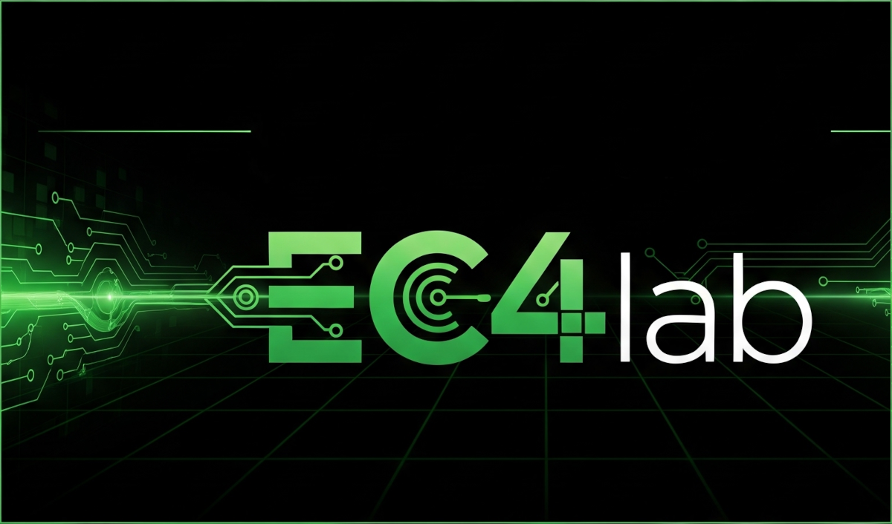

# Esto es EC4lab

Este proyecto es una invitación a experimentar y desarrollar dispositivos electrónicos, software y automatizaciones en la industria y el hogar. Estamos abiertos a explorar todo tipo de dispositivos y plataformas.

¡Nos encantaría que seas parte! Ideas, proyectos, información, traducciones o cualquier cosa son valiosos aportes para esta comunidad crezca.

Esta es una invitación abierta que no requiere conocimientos previos. La documentación está pensada para que cualquier persona, sin importar su nivel de conocimiento, pueda llevar a cabo los proyectos. 

¡Te esperamos con los brazos abiertos!

>Toda la documentación que ves aqui es una recopilación de recursos de internet y experiencias propias puramente con fines didácticos, si encuentras algún error o conoces una mejor forma de realizar los proyectos no dudes en contactarnos. El uso de estos recursos y su implementación en ambitos por fuera de lo educativo queda bajo su responsabilidad.

## 🏗️ Nuestros proyectos
[Utilizar markdown](https://github.com/ec4lab/markdown)
---

Primeros pasos con git y github

[Domótica - HomeAssistant](https://github.com/ec4lab/domotica)
---

Robotica

Arduino

## 📝 Licencia

Este proyecto está licenciado bajo la Licencia MIT.  
Podés usar, copiar, modificar y distribuir el software libremente, siempre que incluyas el aviso de derechos de autor original.

Para más información, consultá el archivo [LICENSE](LICENSE).

## 📫 Contacto

**EC4lab**  
[GitHub: ec4lab](https://github.com/ec4lab)  
[email: ec4lab@gmail.com](ec4lab@gmail.com)

---
